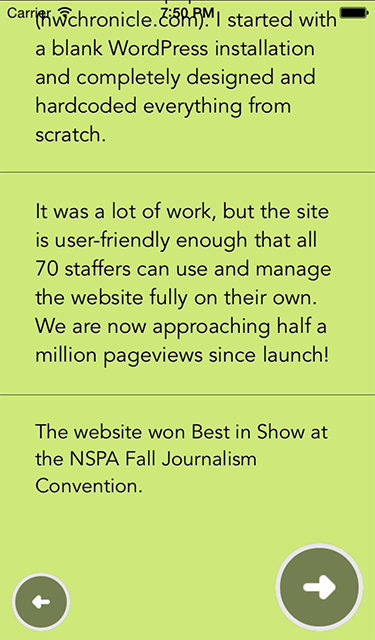

# WWDC Student Scholarship App

WWDC Student Scholarship App is an app submission for Apple's annual [WWDC Student Scholarship](https://developer.apple.com/wwdc/scholarships/) program. It was submitted and selected as one of the winners of the WWDC 2013 Student Scholarship. The sole requirement of the application is to create an iPhone app that talks about your life.

## Project Notes

The app is structured with several pages that flip like a book. Each page is represented by a UIViewController that cycles in and out of screen as the pages are viewed. This is the most embarassing piece of software I have ever made and also likely the most cheesy. Oh gosh I'm looking at the screenshots now and this is humiliating. Wow.. was I really like that?

## License

WWDC Student Scholarship App is [MIT licensed](./LICENSE?raw=true). This project is available for public use for any purpose under the license included.

## Screenshots

